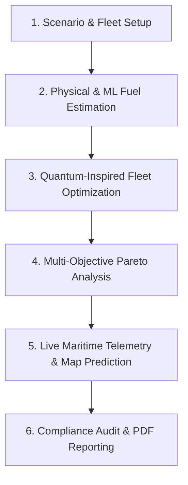

# VATES: Comprehensive Project Overview

**Quantum-Inspired Fuel Consumption Prediction and Green Fleet Optimization**  
*Enterprise Maritime Decarbonization Platform*

---

## 1. Executive Summary

Maritime transportation accounts for approximately 3% of global greenhouse gas (GHG) emissions. Ship operators face severe operational and regulatory challenges:
1. Volatile marine fuel prices and operational expenditures (OPEX).
2. Tightening international decarbonization mandates (IMO GHG Strategy, EU Emissions Trading System [ETS], FuelEU Maritime).
3. Complex non-linear combinatorial optimization challenges: fleet deployment, multi-port scheduling, continuous speed optimization, alternative fuel selection, weather routing, and strict cargo delivery deadlines.

**VATES** is an end-to-end decision support platform that solves this multi-objective problem. It combines:
- **Physical Propulsion & Hydrodynamic Models**: Grounded in naval architecture (Admiralty cube law, load-dependent specific fuel consumption, environmental drag).
- **Machine Learning Regressors**: Fast surrogate fuel consumption predictors trained on maritime telemetry.
- **Quantum-Inspired Metaheuristics (QGA & QPSO)**: Harnessing quantum concepts (qubit superposition, quantum rotation gates, delta potential-well collapse) running on classical hardware for fast convergence without getting trapped in local minima.
- **Real-Time Maritime GIS & AIS Telemetry**: Live map interface with real-time AIS vessel stream integration, watermark-free marine tiles, nautical seamarks, and interactive multi-solution route predictions.

---

## 2. High-Level System Architecture

The project is structured as a decoupled, microservice-ready client-server architecture:

```
┌────────────────────────────────────────────────────────────────────────┐
│                      FRONTEND (React + Vite + TS)                      │
│                                                                        │
│  - Live Fleet Map & Route Predictor (Leaflet, Esri Dark, OpenSeaMap)   │
│  - Interactive Pareto Front & Multi-Objective Visualizer (Recharts)    │
│  - Fleet Assignment & Speed Tuning Dashboard                           │
│  - Multi-Algorithm Convergence & Benchmark Analyzer                    │
│  - Regulatory Compliance & Carbon Tax Impact Calculator                │
│  - Fuel Transition Sandbox & Retrofit Horizon Model                    │
└───────────────────▲────────────────────────────────▲───────────────────┘
                    │ REST API                       │ WebSocket
                    ▼                                ▼
┌────────────────────────────────────────────────────────────────────────┐
│                       BACKEND (FastAPI + Python)                       │
│                                                                        │
│  ┌───────────────────────┐  ┌──────────────────┐  ┌─────────────────┐ │
│  │   Physics Engine      │  │  AIS Manager     │  │ Quantum Engine  │ │
│  │   - Admiralty Power   │  │  - Stream Client │  │ - QGA & GA      │ │
│  │   - SFOC Bowl Curve   │  │  - WS Fan-Out    │  │ - QPSO & PSO    │ │
│  │   - Hull Fouling      │  │  - Stale Eviction│  │ - Hybrid Solver │ │
│  └───────────────────────┘  └──────────────────┘  └─────────────────┘ │
│                                                                        │
│  ┌───────────────────────┐  ┌──────────────────┐  ┌─────────────────┐ │
│  │   ML Surrogate Model  │  │ Regulatory Engine│  │ PDF Reporting   │ │
│  │   - Gradient Boosting │  │  - IMO CII       │  │ - ReportLab     │ │
│  │   - Feature Pipeline  │  │  - EU ETS Carbon │  │ - Executive Diffs││
│  └───────────────────────┘  └──────────────────┘  └─────────────────┘ │
└───────────────────────────────────▲────────────────────────────────────┘
                                    │ SQLAlchemy ORM
                                    ▼
┌────────────────────────────────────────────────────────────────────────┐
│                       DATABASE & DATA LAYER                            │
│  - SQLite (Local Dev) / PostgreSQL (Production)                        │
│  - Vessels, Routes, Demands, Optimization Runs, Scenarios, AIS Cache   │
└────────────────────────────────────────────────────────────────────────┘
```

---

## 3. End-to-End Operational Workflow

The application follows an intuitive 6-stage lifecycle:



1. **Scenario & Fleet Configuration**:
   - Operator selects or creates a shipping scenario (cargo demand, deadlines, route lanes, fuel prices, carbon tax).
   - Operator defines fleet composition (Capesize, Panamax, Supramax, Handysize) with fuel compatibility.

2. **Propulsion & Fuel Estimation**:
   - The physics engine evaluates hydrodynamic resistance, weather drag, and engine load.
   - The ML surrogate model provides instant micro-second fuel predictions across operating envelopes.

3. **Quantum-Inspired Optimization**:
   - **Stage 1 (Discrete Assignment)**: Quantum Genetic Algorithm (QGA) uses qubit state probabilities to assign ships to routes and select bunker fuels.
   - **Stage 2 (Continuous Speed Refinement)**: Quantum Particle Swarm Optimization (QPSO) samples wave-packet collapse positions to fine-tune cruising speeds per leg.

4. **Multi-Objective Trade-Off (Pareto Explorer)**:
   - System presents non-dominated solutions balancing Financial Cost ($) vs Lifecycle Emissions (MT CO₂e).
   - Operator picks specific strategies (Min-Cost, Min-Emissions, Balanced Pareto, Express).

5. **Live Map & Real-World Route Prediction**:
   - Real AIS live vessels stream onto high-resolution watermark-free maritime maps.
   - Interactive Quantum Route Predictor evaluates shipping lanes and renders all candidate route polylines simultaneously.

6. **Compliance Audit & Reporting**:
   - Projects IMO Carbon Intensity Indicator (CII) ratings (A through E).
   - Calculates EU ETS carbon allowance liabilities.
   - Generates publication-ready PDF audit reports.

---

## 4. Comprehensive Feature Breakdown

### 4.1. Dashboard (`/`)
- **Fleet KPI Summary**: Total active vessels, fleet deadweight capacity (DWT), total fuel consumption, lifecycle emissions, and active assignments.
- **Scenario Quick Launch**: One-click execution of seeded benchmark scenarios.
- **Recent Runs Audit**: History of completed optimization runs with runtime metrics and fitness scores.

---

### 4.2. Fuel Consumption Predictor (`/predictor`)
- **Interactive Single-Leg Calculator**: Evaluates vessel fuel consumption under customizable speed, cargo load, distance, fuel type, and sea weather.
- **Surrogate ML vs Physical Model Comparison**: Compares physics-based Admiralty equation against the trained Gradient Boosting ML model.
- **Sensitivity Curves**: Plots fuel consumption vs speed curves, illustrating the cubic propulsion power penalty.

---

### 4.3. Fleet Optimizer (`/optimizer`)
- **Joint Deployment & Speed Tuning**: Assigns an entire fleet of heterogeneous vessels across multiple global routes rather than optimizing a single ship in isolation.
- **Constraint Satisfaction**:
  - Cargo capacity compliance (no vessel overloaded beyond DWT).
  - Delivery deadline enforcement (penalizes tardiness).
  - Fuel compatibility matching (vessels only burn certified bunker types).
- **Interactive Solver Configuration**:
  - Choice of Algorithm: QGA, GA, QPSO, PSO.
  - Population size, iteration budget, and random seed.
  - Multi-objective weight sliders (Fuel Cost vs Lifecycle Carbon vs Schedule Reliability).

---

### 4.4. Fuel Transition Sandbox (`/sandbox`)
- **Alternative Fuel Economics**: Evaluates conventional fuels (HFO, MGO) against zero/low-carbon fuels (LNG, Green Methanol, Green Ammonia, Liquid Hydrogen).
- **Life-Cycle Carbon Accounting**: Breaks down emissions into Tank-to-Wake (TtW - combustion) and Well-to-Tank (WtT - production and supply chain).
- **Retrofit Payback Horizon**: Calculates Capex retrofit amortisation vs fuel savings and avoided carbon taxation over 5 to 25 year investment horizons.

---

### 4.5. Pareto Front Explorer (`/pareto`)
- **Trade-Off Scatter Visualization**: Visualizes the non-dominated frontier between total operational cost ($) and lifecycle CO₂e emissions.
- **Plan Selection**: Allows decision-makers to inspect and select:
  - *Minimum Cost Plan* (commercial baseline).
  - *Minimum Emissions Plan* (maximum decarbonization).
  - *Balanced Quantum Compromise* (best cost-per-tonne-carbon reduced).

---

### 4.6. Multi-Algorithm Benchmarking (`/benchmark`)
- **Head-to-Head Comparison**: Runs QGA, GA, QPSO, and PSO on identical scenario constraints.
- **Statistical Rigor**: Measures Best Fitness, Average Fitness, Standard Deviation, and Convergence Time across multiple independent seeded runs.
- **Convergence Graphs**: Real-time Recharts curves showing iteration-by-iteration optimization progress.

---

### 4.7. Regulatory Compliance & Carbon Tax (`/compliance`)
- **IMO CII Rating Engine**: Computes annual grams of CO₂ emitted per DWT-nautical mile, assigning regulatory letter grades (**A, B, C, D, E**).
- **EU ETS Liability Calculator**: Computes carbon financial exposure under European Union allowance pricing ($/tonne CO₂).
- **Penalty Trajectory**: Forecasts future non-compliance fines as emission caps step down annually.

---

### 4.8. Fleet Data Management (`/fleet`)
- **Fleet Registry**: Comprehensive table of registered vessels (name, class, DWT, engine power, speed boundaries, fuel compatibility).
- **CSV Ingestion**: Bulk upload fleet specs with schema validation and error reporting.
- **Route Catalogue**: Geographic distance, typical weather state, and port turnaround hours.

---

### 4.9. Scenario Manager (`/scenarios`)
- **Interactive "What-If" Analysis**: Create, clone, modify, and delete operational scenarios.
- **Dynamic Parameter Tweaking**: Adjust bunker prices, cargo demand surges, vessel availability, or weather conditions to test fleet resilience.
- **Scenario Comparison**: Side-by-side comparative table of optimization outcomes across scenarios.

---

### 4.10. Live Maritime Telemetry & Map (`/live-map`)
- **Watermark-Free Multi-Layer GIS**:
  - *Dark Maritime*: High-contrast Esri Dark Canvas.
  - *Satellite Imagery*: High-resolution Earth observation.
  - *OpenStreetMap*: Standard navigational map.
  - *OpenSeaMap*: Nautical seamarks, buoys, beacons, and fairway aids overlay.
- **Real-Time AIS Stream Integration**:
  - Streams live global vessels via WebSocket from AISStream API without client-side API exposure.
  - Click-to-pan (`flyTo`) focusing directly on live vessel coordinates.
- **Interactive Quantum Route Predictor**:
  - Select origin/destination shipping lanes, fuel types, fuel price, vessel class, sea weather, algorithm, and optimization target (*Balanced, Min Cost, Min Emissions, Fastest*).
  - **Simultaneous Multi-Polyline Map Rendering**: Draws 5 distinct candidate route paths on the map simultaneously:
    - 🟢 *Quantum Pareto Optimal* (Green)
    - 🟣 *Min Emissions / Eco Fleet* (Violet)
    - 🔵 *Minimum Operational Cost* (Cyan)
    - 🟡 *Fast Express Lane* (Amber)
    - 🔷 *Weather-Resilient Path* (Blue)
  - **Bi-Directional Route Inspector**: Clicking any map route polyline or sidebar card updates the real-time cost, emissions, fuel tonnes, transit duration, and AI rationale breakdown.
- **Dual-Axis Telemetry Chart**: Time-series graph displaying Speed Over Ground (SOG kn) vs wave impact accelerations.

---

### 4.11. Executive PDF Reporting (`/reports`)
- **Audit-Ready Exports**: Generates multi-page PDF executive summaries using ReportLab.
- **Included Sections**: Fleet deployment table, fuel consumption charts, Pareto trade-off breakdown, CII ratings, and algorithmic benchmark proofs.

---

## 5. Mathematical & Physical Formulations

### 5.1. Propulsion Power (Admiralty Coefficient)
Displacement hull propulsion power scales cubically with vessel speed:

$$P_{\text{prop}}(v) = P_{\text{design}} \cdot \left(\frac{v}{v_{\text{design}}}\right)^3$$

### 5.2. Displacement & Cargo Resistance Scaling
Cargo loading affects wetted surface area and displacement resistance:

$$k_{\text{load}} = \left(0.55 + 0.45 \cdot \frac{m_{\text{cargo}}}{\text{DWT}}\right)^{0.42}$$

### 5.3. Environmental Resistance Factor
Added resistance from wind and wave encounters:

$$f_{\text{env}} = \left(1.0 + 0.0018 \cdot v_{\text{wind}}^{1.35}\right) \cdot \left(1.0 + 0.030 \cdot h_{\text{wave}}^{1.6}\right)$$

### 5.4. Specific Fuel Oil Consumption (SFOC) Bowl Model
2-stroke marine diesel engines exhibit optimal thermal efficiency near 75% Maximum Continuous Rating (MCR):

$$\text{SFOC}(L) = \text{SFOC}_{\text{ref}} \cdot \left[1.0 + 0.45 \cdot \left(\frac{L - 0.75}{0.75}\right)^2 + 0.22 \cdot \max(0, 0.35 - L)\right]$$

*Where $L$ is the engine load fraction.*

### 5.5. Total Voyage Fuel Consumption
$$\text{Fuel} = \int_{0}^{T_{\text{sea}}} \left(P_{\text{prop}} \cdot \text{SFOC}\right) dt + \int_{0}^{T_{\text{voyage}}} \left(P_{\text{aux}} \cdot \text{SFOC}_{\text{aux}}\right) dt$$

---

## 6. Quantum-Inspired Algorithms

### 6.1. Quantum Genetic Algorithm (QGA)
In QGA, a candidate solution is represented by a string of Qubits:

$$|q\rangle = \alpha |0\rangle + \beta |1\rangle, \quad |\alpha|^2 + |\beta|^2 = 1$$

- **Superposition**: Population explores multiple fleet assignment states concurrently.
- **Quantum Rotation Gates**: Probability amplitudes are updated towards the best-performing individual:

$$\begin{pmatrix} \alpha_{t+1} \\ \beta_{t+1} \end{pmatrix} = \begin{pmatrix} \cos(\Delta\theta) & -\sin(\Delta\theta) \\ \sin(\Delta\theta) & \cos(\Delta\theta) \end{pmatrix} \begin{pmatrix} \alpha_t \\ \beta_t \end{pmatrix}$$

### 6.2. Quantum Particle Swarm Optimization (QPSO)
Unlike classical PSO with position and velocity vectors, QPSO assumes particles move in a delta potential well:

$$X_{t+1} = P \pm \alpha \cdot |mbest - X_t| \cdot \ln(1/u)$$

- Guarantees global search coverage and avoids entrapment in local sub-optimal speed valleys.

---

## 7. Technology Stack Summary

| Layer | Technologies Used |
|---|---|
| **Frontend Framework** | React 18, TypeScript, Vite, Tailwind CSS |
| **Mapping & GIS** | Leaflet, React-Leaflet, Esri World Canvas, OpenSeaMap, OpenStreetMap |
| **Data Visualization** | Recharts, Lucide Icons, Canvas API |
| **Backend Framework** | Python 3.11+, FastAPI, Uvicorn (ASGI) |
| **Database & ORM** | SQLAlchemy 2.0, SQLite / PostgreSQL |
| **Machine Learning & Math** | Scikit-learn, NumPy, Pandas, Joblib |
| **Live Telemetry** | WebSockets (`websockets`, `httpx`), AISStream API |
| **Document Generation** | ReportLab (PDF Engine) |
| **Testing** | Pytest, Pytest-Asyncio, Starlette TestClient |

---

## 8. Verification & Test Metrics

- **Backend Pytest Coverage**: **108 automated unit and integration tests passing** (100% pass rate).
- **Frontend Build**: Strict TypeScript bundle compilation via `tsc -b && vite build` passing with **0 errors**.
- **Live WebSocket Streaming**: Active client connection handling with automatic exponential-backoff reconnects.
