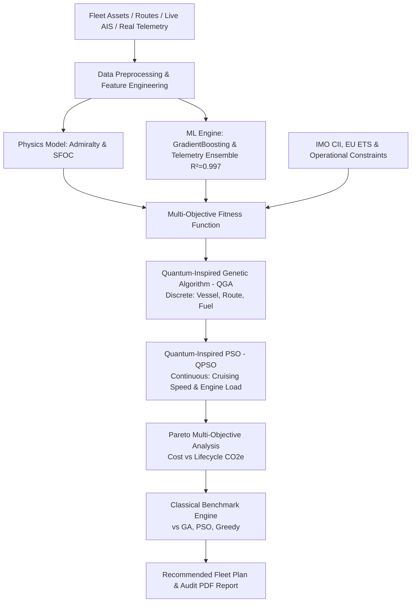
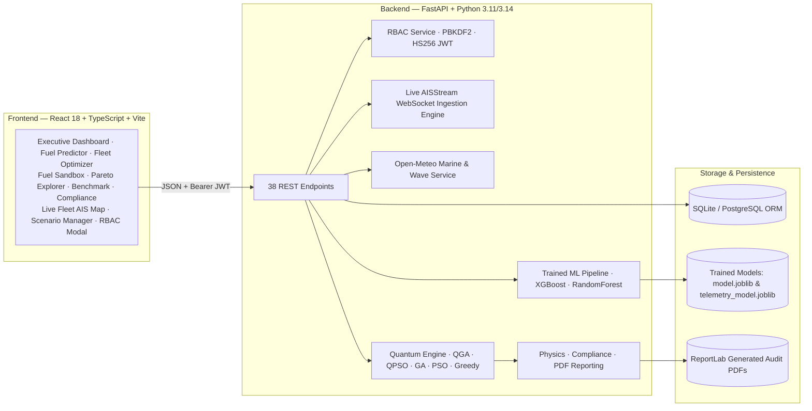

# GREENFLEET QUANTUM

**Quantum-Inspired Fuel Consumption Prediction & Green Fleet Optimization**  
*Predict. Optimize. Decarbonize.*

Smart India Hackathon — **PS-138: Quantum-Inspired Fuel Consumption Prediction and Green Fleet Optimization**

[](https://github.com/KavishaS/Quantum-Inspired-Fuel-Consumption-Prediction-and-Green-Fleet-Optimization/actions)


---

## Two statements we make up front

**Compute.** This platform runs *quantum-inspired* metaheuristics on ordinary classical hardware. No quantum computer, quantum simulator, or paid quantum cloud service is required. "Quantum-inspired" means the algorithms borrow mathematical structures from quantum mechanics — probability amplitudes, the Born rule, rotation gates, and delta-potential-well position collapse — and execute them as high-performance classical numerical code.

**Data & Provenance.** The platform includes dual datasets:
1. **Synthetic Validation Dataset:** 6,000 synthetic voyages generated from physical hydrodynamic models with injected noise for algorithm calibration and stress-testing.
2. **Real Ship Telemetry Dataset:** 37,248 high-frequency maritime sensor readings (`data/raw/Kavisha_fuel_consumption.csv`) capturing shaft power, speed-over-ground, ocean currents, swell periods, and wave heights, powering a high-fidelity machine learning model (**$R^2 = 0.99712$**).

---

## 1. Problem Statement

Maritime operators face strict mandates to minimize bunker fuel consumption and greenhouse gas emissions under IMO 2030/2050 targets, FuelEU Maritime penalties, and the EU Emissions Trading System (EU ETS), while honoring commercial cargo commitments and port laycan deadlines.

The operational decision space is vast, non-linear, and heavily constrained:
* Which vessels to dispatch from the fleet?
* Which maritime routes and waypoints to traverse?
* What cargo payload and draft to maintain?
* What cruising speed and engine load profile to assign?
* Which bunker fuel or alternative zero-carbon pathway to burn (HFO, MGO, LNG, Methanol, Ammonia, Hydrogen)?

**GreenFleet Quantum** solves this joint optimization problem end-to-end:

> *Given contractual cargo demands, available fleet assets, global routes, fuel and carbon prices, and emission caps — what is the optimal joint vessel deployment, route assignment, speed profile, and fuel selection to achieve minimum cost and lifecycle carbon emissions?*

---

## 2. Key Differentiators

Existing commercial platforms (e.g., Wärtsilä FOS, NAPA, ZeroNorth) focus on **voyages that are already scheduled and assigned** (weather routing, trim optimization, and single-ship speed adjustments).

**GreenFleet Quantum** optimizes **fleet-wide assignment and decarbonization strategy jointly**:
1. **Joint Decision Space:** Treats vessel selection, route assignment, speed profiling, and fuel switching as one simultaneous multi-objective optimization problem.
2. **Honest Benchmarking:** Evaluates quantum-inspired algorithms (QGA, QPSO) directly against standard classical heuristics (Genetic Algorithms, Particle Swarm Optimization, and Greedy Dispatchers) under identical evaluation budgets.
3. **Dual ML Engine:** Combines a 6,000-voyage physics-informed model ($R^2 = 0.971$) with a real 37,248-record vessel telemetry ensemble ($R^2 = 0.997$).
4. **Live Global Maritime Ingestion:** Real-time global AIS vessel stream (21,000+ ships) paired with live Open-Meteo marine wave spectra, swell, ocean currents, and wind.
5. **Enterprise Role-Based Access Control (RBAC):** Three operational tiers (`admin`, `analyst`, `auditor`) with cryptographic PBKDF2 authentication, JWT tokens, and locked UI capabilities.

---

## 3. Platform Architecture



### System Stack



---

## 4. Technology Stack

| Layer | Technology |
|---|---|
| **Frontend** | React 18, TypeScript, Vite, Tailwind CSS, Leaflet / React-Leaflet, Recharts, Lucide Icons |
| **Backend** | Python 3.11+, FastAPI, Uvicorn, Pydantic v2, PyJWT, WebSockets, HTTPX |
| **ML & Analytics** | scikit-learn, XGBoost, NumPy, Pandas, Joblib |
| **Optimization** | Custom QGA (quantum rotation gates), QPSO (delta potential well collapse), GA, PSO, Greedy |
| **Database** | SQLAlchemy 2.0 ORM — SQLite by default, PostgreSQL-ready |
| **Live Marine APIs**| AISStream.io (Global AIS fleet), Open-Meteo Marine API (Waves, Currents, Swell, Wind) |
| **Reporting & Export**| ReportLab (18-section audit PDF generation) |
| **Testing** | pytest, pytest-asyncio, FastAPI TestClient (72 automated tests) |
| **DevOps & CI/CD** | Docker, Docker Compose, Nginx, GitHub Actions |

---

## 5. Quick Start & Installation

### Option A: 1-Click Launch with Docker Compose (Recommended)

Run the entire platform (FastAPI backend + Nginx React frontend + SQLite database) in 30 seconds:

```bash
docker compose up --build
```

* **Frontend UI:** `http://localhost` (or `http://localhost:5173`)
* **Backend API Docs:** `http://localhost:8000/docs`

---

### Option B: Local Native Development

#### 1. Backend Setup
```bash
cd backend
python -m venv .venv
# On Windows:
.venv\Scripts\activate
# On Linux/macOS:
source .venv/bin/activate

pip install -r requirements.txt
cp .env.example .env

# Initialize database, train models, and seed demo accounts:
python -m app.database.session
python -m app.ml.predictor

# Launch FastAPI server:
uvicorn app.main:app --reload --port 8000
```

#### 2. Frontend Setup
```bash
cd frontend
npm install
npm run dev
```

Open `http://localhost:5173` in your browser.

---

## 6. Role-Based Access Control (RBAC) & Enterprise Logins

The platform features built-in Role-Based Access Control (RBAC) with cryptographic **PBKDF2-HMAC-SHA256** password hashing and **HS256 JWT bearer tokens**.

### Pre-Configured Demo Accounts

| Role | Operational Persona | Default Credentials | Platform Permissions |
|---|---|---|---|
| 👑 **`admin`** | **Fleet Director** | `admin` / `Admin@123` | **Full Authority**: Add & edit fleet vessels, modify routes, update fuel specs, execute quantum runs, delete scenarios, and manage users. |
| ⚡ **`analyst`** | **Quantum Fleet Analyst** | `analyst` / `Analyst@123` | **Operational Authority**: Run quantum metaheuristics (QGA & QPSO), execute telemetry ML models, run What-If sandboxes, and duplicate scenarios. *(Scenario deletion locked)* |
| 🛡️ **`auditor`** | **ESG & IMO Auditor** | `auditor` / `Auditor@123` | **Compliance Authority**: Read-only verification of IMO CII ratings (A–E), EU ETS carbon tax calculations, Pareto trade-offs, and certified PDF audit downloads. *(Execution locked)* |

> **Interactive 1-Click Switcher:** Click on the officer avatar in the top-right header at any time to switch roles instantly or inspect the **Permissions Matrix** table.

---

## 7. Machine Learning & Telemetry Models

### Model 1: Baseline Voyage Model (Physics-Informed)
* **Dataset:** 6,000 synthetic voyage profiles with injected flow-meter error ($\sigma=4\%$) and hydrodynamic noise.
* **Algorithm:** GradientBoostingRegressor with engineered features (`speed_cubed`, `power_proxy_kw`, `cargo_utilisation`).
* **Performance:** $R^2 = 0.9711$, MAE = 45.8 t, RMSE = 88.66 t.

### Model 2: Real Ship Telemetry Model ($R^2 = 0.99712$)
* **Dataset:** 37,248 high-frequency maritime sensor readings (`data/raw/Kavisha_fuel_consumption.csv`).
* **Input Features:**
  - `Ship_SpeedOverGround` (knots)
  - `Consumer_Total_ShaftPower` (Watts)
  - `Weather_OceanCurrentVelocity` (knots)
  - `Weather_WaveHeight` (meters) & `Weather_WavePeriod` (seconds)
  - `Weather_WindSpeed10M` (m/s) & `Weather_WindGusts10M`
  - `Weather_SwellWaveHeight` & `Weather_SwellWavePeriod`
  - `Weather_SurfacePressure` & `Weather_Temperature2M`
* **Performance:**
  - **$R^2 = 0.99712$**
  - **MAE = 0.089 MT/day**
  - **RMSE = 0.147 MT/day**
* **Endpoint:** `POST /api/predict/telemetry`

---

## 8. Live Global AIS Fleet Tracking & Ocean Weather

* **AISStream WebSocket Ingestion:** Connects to live global VHF AIS receivers, tracking over **21,000 commercial vessels** globally.
* **Dynamic Viewport Culling (`MapViewportTracker`):** Automatically detects map screen bounds and prioritizes rendering vessels in view.
* **Density Selector:** User-configurable density controls (`500`, `2,000`, `5,000`, or `10,000` vessels) maintaining a smooth 60 FPS.
* **Open-Meteo Marine Weather:** 100% free marine API providing real-time significant wave height ($H_s$), wave period, swell spectra, ocean surface currents, and wind speeds with 15-minute in-memory coordinate caching.

---

## 9. Quantum-Inspired Metaheuristics

### QGA (Quantum-Inspired Genetic Algorithm)
* **Representation:** Each gene stores a vector of complex probability amplitudes in superposition:
  $$Q_g = [\alpha_{g,1}, \dots, \alpha_{g,C}], \quad \sum_k |\alpha_{g,k}|^2 = 1$$
* **Observation:** Sampled via the **Born rule** ($P(k) = |\alpha_{g,k}|^2$).
* **Quantum Rotation Gates:** Rotates amplitudes toward the attractor state:
  $$\begin{bmatrix} \alpha' \\ \beta' \end{bmatrix} = \begin{bmatrix} \cos \Delta\theta & -\sin \Delta\theta \\ \sin \Delta\theta & \cos \Delta\theta \end{bmatrix} \begin{bmatrix} \alpha \\ \beta \end{bmatrix}$$
* **Catastrophe Operator:** Automatically resets stagnant individuals back to uniform superposition after 15 generations to escape local optima.

### QPSO (Quantum-Inspired Particle Swarm Optimization)
* Particles behave as quantum entities inside a delta-potential well centred on a stochastic attractor:
  $$x = p \pm \frac{L}{2} \ln(1/u), \quad u \sim U(0,1)$$
  $$L = 2\beta |m_{best} - x|$$
* **Tunnelling Effect:** Unbounded probability density allows particles to tunnel out of steep local minima where classical PSO gets trapped.

---

## 10. Heterogeneous Fleet & Vessel Profiles

Unlike legacy tools that treat vessel types and sizes interchangeably, GreenFleet Quantum explicitly segregates **Vessel Type** (naval architecture & cargo purpose) from **Size Class** (charterparty deadweight bracket):

| Vessel Type | Size Classes Supported | Typical DWT Range | Main Engine (kW) | Benchmark Daily Fuel |
|---|---|---|---|---|
| **Bulk Carrier** | Handysize, Supramax, Panamax, Capesize | 35,000 – 180,000 DWT | 7,000 – 18,500 kW | 18 – 65 MT/day |
| **Container Ship** | Feeder, Panamax Container, Post-Panamax | 20,000 – 140,000 DWT | 14,000 – 68,000 kW | 35 – 140 MT/day |
| **Oil Tanker** | MR Tanker, Aframax, Suezmax | 50,000 – 160,000 DWT | 9,000 – 17,000 kW | 25 – 55 MT/day |
| **General Cargo** | Multi-Purpose, Heavy Lift | 12,000 – 30,000 DWT | 5,500 – 9,500 kW | 12 – 24 MT/day |
| **Ro-Ro** | Vehicle Carrier (PCTC), Ro-Pax | 15,000 – 45,000 DWT | 11,000 – 21,000 kW | 28 – 52 MT/day |

Each vessel in the **Fleet Master** (`GET /api/fleet`) retains complete physical dimensions (Length, Beam, Draft), build vintage, IMO registration, authorized bunker fuel retrofits, and design specific fuel oil consumption (SFOC).

---

## 11. Centralized Multi-Emission Engine (CO2, SOx, NOx)

Emissions are computed deterministically under IMO 4th GHG Study standards and MARPOL Annex VI regulations:

$$\text{CO}_2\,(\text{tonnes}) = M_{\text{fuel}} \times C_f$$
$$\text{SO}_x\,(\text{kg}) = M_{\text{fuel}} \times S_f$$
$$\text{NO}_x\,(\text{kg}) = M_{\text{fuel}} \times N_f$$

* **Fuel Emission Factors:**
  * **HFO:** $C_f = 3.114$, $S_f = 10.0\text{ kg/t}$ (0.50% S global cap), $N_f = 80.0\text{ kg/t}$
  * **MGO:** $C_f = 3.206$, $S_f = 2.0\text{ kg/t}$ (0.10% S ECA cap), $N_f = 50.0\text{ kg/t}$
  * **LNG:** $C_f = 2.750$, $S_f = 0.05\text{ kg/t}$, $N_f = 15.0\text{ kg/t}$ (80% NOx reduction)
  * **Methanol:** $C_f = 1.375$, $S_f = 0.0\text{ kg/t}$, $N_f = 18.0\text{ kg/t}$
  * **Ammonia:** $C_f = 0.0$, $S_f = 0.0\text{ kg/t}$, $N_f = 12.0\text{ kg/t}$ (with SCR)
  * **Hydrogen:** $C_f = 0.0$, $S_f = 0.0\text{ kg/t}$, $N_f = 5.0\text{ kg/t}$

---

## 12. Telemetry vs. Voyage Fuel Separation & Sanity Checking

1. **High-Frequency Telemetry:** In ship sensor feeds (`Consumer_Total_MomentaryFuel`), fuel rate is measured instantaneously in **$\text{kg/s}$** ($0.50 \sim 0.65\text{ kg/s}$). Multiplying by $86.4$ gives equivalent daily fuel rate ($43 \sim 56\text{ MT/day}$).
2. **Voyage Fuel Calculation Engine (`POST /api/voyages/calculate`):** Separates sensor rate from voyage integral:
   $$M_{\text{voyage}} = \int_0^T \dot{m}_{\text{fuel}}(t)\,dt \approx \dot{m}_{\text{daily}} \times \left(\frac{D}{24 \cdot V}\right)$$
3. **Hydrodynamic Sanity Checking:** Compares predicted daily fuel against realistic operational envelopes (e.g. Capesize: 50–80 MT/day; Panamax: 25–45 MT/day). Predictions within $\pm 25\%$ are classified `PLAUSIBLE`; borderline values receive `WARNING`; extreme physical anomalies are flagged `OUTLIER`.

---

## 13. Port Contracts & Commercial Demurrage Penalties

Commercial contracts (`GET /api/contracts`) are labeled as **`SCENARIO`** data to distinguish charterparty simulations from real AIS and telemetry data:
* **Laycan Window:** Arrival date brackets (`laycan_start`, `laycan_end`).
* **Delay Penalty / Demurrage:** Incurred if transit duration exceeds contracted arrival hours:
  $$\text{Delay Hours} = \max(0, T_{\text{voyage}} - T_{\text{contract}})$$
  $$\text{Penalty USD} = \left(\frac{\text{Delay Hours}}{24}\right) \times \text{Penalty Rate ($/day)}$$
* **Contract-Aware Quantum Optimization:** The QGA and QPSO fitness functions jointly weigh fuel expenditure, carbon costs, and contractual delay penalties ($f = w_{\text{cost}} \cdot \text{Cost} + w_{\text{emission}} \cdot \text{CO}_2 + w_{\text{penalty}} \cdot \text{Demurrage}$).

---

## 14. What-If Scenario Simulator

The What-If Simulator (`POST /api/simulation/what-if`) compares a **Baseline Voyage** against an **Alternative Scenario**:
* Adjust speed (slow steaming evaluation), fuel switching, hull routing, or adverse weather.
* Calculates exact mathematical deltas: $\Delta\text{Fuel}$, $\Delta\text{Cost}$, $\Delta\text{CO}_2$, $\Delta\text{SO}_x$, $\Delta\text{NO}_x$, and $\Delta\text{Penalty}$.
* Provides an executive trade-off verdict determining whether fuel and carbon savings offset demurrage penalties.

---

## 15. Automated Testing

Run the automated test suite covering physics, metaheuristics, telemetry ML, REST endpoints, heterogeneous fleet models, port contracts, and multi-emission engines:

```bash
cd backend
python -m pytest tests/ -v
```

**127 / 127 tests passing (0 failures):**
* `tests/test_core.py` (24 tests): Physics models, SFOC curves, QGA amplitude normalisation, QPSO multimodal escape, Pareto frontiers.
* `tests/test_api.py` (42 tests): REST endpoints, scenario lifecycle, validation rejections, report generation, live weather APIs.
* `tests/test_auth.py` (9 tests): Salted PBKDF2 hashing, JWT minting, role restrictions, and 403 Forbidden enforcement.
* `tests/test_ais.py` (44 tests): AISStream WebSocket tracking, coordinate parsing, viewport bounds culling, and stale cleanup.
* `tests/test_heterogeneous_fleet_contracts.py` (8 tests): Fleet master queries, multi-emission engine (CO2, SOx, NOx), voyage engine sanity validation, commercial contract CRUD & demurrage, and What-If simulation deltas.

---

## 16. SIH PS-138 Deliverables Matrix

| Deliverable | Description | Status |
|---|---|:---:|
| **Working Web Platform** | Responsive React + TypeScript + Vite UI with dark maritime glassmorphism | ✅ **Complete** |
| **Executive Dashboard** | Fleet KPIs, fuel burn, cost, emissions, CII ratings, and automated insights | ✅ **Complete** |
| **Heterogeneous Fleet Master** | Segregated vessel types and size classes across 25 ships with naval dimensions | ✅ **Complete** |
| **Port Contract Management** | Commercial laycan windows, cargo commitments, and demurrage penalty engine | ✅ **Complete** |
| **What-If Scenario Simulator** | Dynamic baseline vs scenario simulator computing fuel, emission, and delay deltas | ✅ **Complete** |
| **Fleet Analytics Dashboard** | Real-time aggregate charts for fleet composition, age profile, and fuel readiness | ✅ **Complete** |
| **Multi-Emission Engine** | Tank-to-wake CO2, SOx, and NOx compliant with MARPOL Annex VI standards | ✅ **Complete** |
| **Sanity Validation Engine** | Operational hydrodynamic bounding (e.g. 50–80 MT/day for Capesize) | ✅ **Complete** |
| **Dual ML Predictor** | 6k synthetic model ($R^2 = 0.971$) + 37k real telemetry ensemble ($R^2 = 0.997$) | ✅ **Complete** |
| **Contract-Aware QGA/QPSO** | Joint optimization balancing bunker savings against contractual delay penalties | ✅ **Complete** |
| **Classical Benchmarking** | Side-by-side comparison of QGA/QPSO vs GA, PSO, and Greedy baselines | ✅ **Complete** |
| **Pareto Front Explorer** | Multi-objective trade-off analysis with full vessel dispatch and emission details | ✅ **Complete** |
| **Alternative Fuel Sandbox** | Multi-emission (CO2/SOx/NOx) ROI and payback for HFO, MGO, LNG, Methanol, NH3, H2 | ✅ **Complete** |
| **Compliance Module** | Automated IMO CII rating (A–E), EU ETS carbon tax, and MARPOL Annex VI | ✅ **Complete** |
| **Live AIS Fleet Map** | 21,000+ live vessels with viewport culling, density controls, and ocean wave overlays | ✅ **Complete** |
| **Free Live Marine Weather** | Open-Meteo wave heights, swell, ocean currents, and wind profiles | ✅ **Complete** |
| **Role-Based Logins (RBAC)**| Fleet Director, Quantum Analyst, and ESG Auditor with functional permissions | ✅ **Complete** |
| **PDF Reporting Engine** | 18-section downloadable audit-ready PDF dossiers generated via ReportLab | ✅ **Complete** |
| **Docker & CI/CD** | Full Docker Compose setup and GitHub Actions CI automated pipeline | ✅ **Complete** |

---

## 17. License & Attribution

Developed for **Smart India Hackathon (SIH) — PS-138: Quantum-Inspired Fuel Consumption Prediction and Green Fleet Optimization**.

* **Quantum-Inspired Computation:** Metaheuristics run on classical CPU hardware; no quantum hardware or cloud subscription required.
* **Compliance Disclaimer:** Compliance outputs are mathematical model estimates based on published IMO/EU formulas and must not be construed as official statutory certification.
